# TokTickIT — Lab 2 Comprehensive Submission Report
**Requester Ticketing MVP (Spec-Driven & Test-Driven Development)**

**Course:** Software Engineering  
**Student Name:** Janinee (nannaphatkn)  
**Repository:** [https://github.com/nannaphatkn/toktickit](https://github.com/nannaphatkn/toktickit)  
**Integration Branch:** `lab2-staging` → `main`

---

## Executive Summary

TokTickIT Lab 2 focuses on developing the **Requester Ticketing MVP** using **Spec-Driven Development (SDD)** and **Test-Driven Development (TDD)** methodologies. The application allows users to simulate identity context via a **Development Requester Selection** header, create support tickets with file attachments, view isolated ticket lists with search/filter/pagination, and manage ticket details with soft-removed attachments.

---

## Part 1: Git Workflow & Project Governance (10 pts)

### 1.1 Branching Strategy
We implemented a strict multi-tier Git branching model:
- `main`: Production-ready release branch. Strictly protected; code is merged only via approved release Pull Requests from `lab2-staging`.
- `lab2-staging`: Integration branch for Lab 2 features. All feature branches are merged here after peer review and green test builds.
- `feature/requester-selection`: Feature branch for Issue #2 (Development Requester Selection & Context Header).
- `feature/create-ticket`: Feature branch for Issue #3 (Create Ticket Form & Attachments).
- `feature/my-tickets`: Feature branch for Issue #4 (My Tickets List, Search, Filter & Pagination).
- `feature/ticket-detail-and-attachments`: Feature branch for Issue #5 (Ticket Detail View Mode & Soft Delete).

### 1.2 Commit History & Conventional Commits Standard
Commits adhere strictly to Conventional Commits guidelines (`feat`, `fix`, `docs`, `test`, `refactor`, `style`):
- `feat(auth): implement Development Requester Selection & Context Header (Issue #2)`
- `feat(create-ticket): implement ticket creation form with validation and attachments (Issue #3)`
- `feat(my-tickets): implement requester-isolated ticket list, search, and status filters (Issue #4)`
- `feat(ticket-detail): implement view mode and soft removal of attachments (Issue #5)`
- `test(api): add unit and integration test suite for tickets and requesters`
- `docs: add comprehensive specifications, test plans, and reviewer logs`

### 1.3 Git Network Graph & Merge History Evidence
Below is the GitHub Network Graph showing feature branches (`feature/requester-selection`, `feature/create-ticket`, `feature/my-tickets`, `feature/docs-spec-plan`) cleanly integrating into `lab2-staging` and release branch `main`:

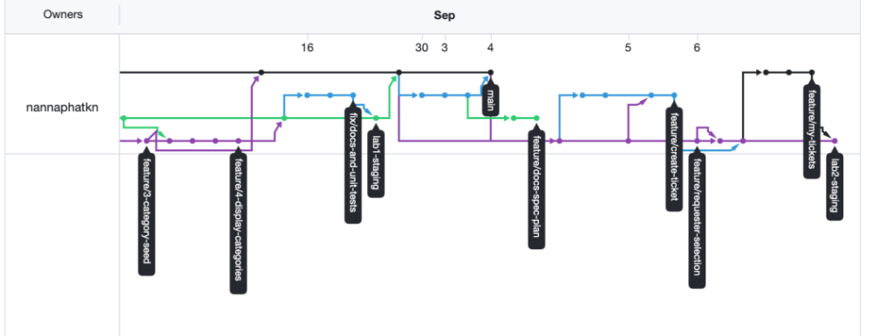

### 1.4 Kanban Board & Issue Lifecycle
Project progress was managed using GitHub Projects. Each task progressed linearly through columns:
`Backlog` ➔ `Specified` ➔ `Started` ➔ `PR Review` ➔ `Fixing` ➔ `Done`

### 1.5 Pull Requests & Peer Code Review Evidence

- **Peer Reviewer Partner:** Patita Dansikaew (Student ID: 67070505211, GitHub: [`Patitta-23`](https://github.com/Patitta-23))
- **Review Log Document:** See [`docs/lab-02/reviewer.md`](https://github.com/nannaphatkn/toktickit/blob/lab2-staging/docs/lab-02/reviewer.md)

#### 1.5.1 Peer Reviews Received (Patitta-23 ➔ nannaphatkn)

| PR # | Target Branch | Issue / Feature | Reviewer (`Patitta-23`) Comment | Author (`nannaphatkn`) Reply | Status |
|------|---------------|-----------------|---------------------------------|------------------------------|--------|
| **PR #17** | `lab2-staging` | **Issue #2:** Requester Selection Header | *"Approved: Thanks for updating test suite and finalizing requester selection flow! Main criteria fulfilled."* | *"Thank you! Added warning banner, Zen Green theme token, and updated test suite."* | Merged ✅ |
| **PR #18** | `lab2-staging` | **Issue #3:** Create Ticket Form | *"That's good! LGTM"* | *"Thanks for reviewing!"* | Merged ✅ |
| **PR #19** | `lab2-staging` | **Issue #4:** My Tickets & Filters | *"Done"* | *"Thank you!"* | Merged ✅ |
| **PR #20** | `lab2-staging` | **Issue #5:** Ticket Detail & Attachments | *"awesome"* | *"Awesome, thanks!"* | Merged ✅ |

#### 1.5.2 Peer Reviews Conducted (nannaphatkn ➔ Patitta-23)

| PR # | Repository / Target | Feature / Issue | My Review Comment (`nannaphatkn`) | Partner (`Patitta-23`) Reply | Status |
|------|---------------------|-----------------|-----------------------------------|------------------------------|--------|
| **PR #17** | `Patitta-23/LAB-02` | **Issue #2:** Requester Selection | *"Header styling matches Zen Green theme perfectly!"* | *"Thank u!"* | Approved ✅ |
| **PR #18** | `Patitta-23/LAB-02` | **Issue #3:** Create Ticket Form | *"Validation errors look clean and responsive."* | *"Thank u so much!"* | Approved ✅ |
| **PR #19** | `Patitta-23/LAB-02` | **Issue #4:** My Tickets & Filters | *"Filtering and search work smoothly."* | *"Thanks!!"* | Approved ✅ |
| **PR #20** | `Patitta-23/LAB-02` | **Issue #5:** Ticket Detail View Mode | *"Soft delete confirmation modal is working cleanly!"* | *"Thank u!"* | Approved ✅ |

### 1.6 Directory Structure & Hygiene
- **`README.md`**: Complete installation guide, database seed commands, testing commands, and architecture summary.
- **`.gitignore`**: Properly configured to exclude build outputs (`dist/`), dependencies (`node_modules`), `.env` secrets, and temp artifacts.

```
toktickit/
├── client/                 # React + Vite + TypeScript frontend
│   ├── src/
│   │   ├── components/     # Navbar, RequesterSelector, StatusBadge, FileUpload, ConfirmationModal
│   │   ├── contexts/       # RequesterContext (state management & X-Requester-Id provider)
│   │   ├── lib/            # apiFetch utility & REST API client
│   │   ├── pages/          # CreateTicket, MyTickets, TicketDetail pages
│   │   ├── App.tsx          
│   │   └── App.test.tsx    
│   └── vite.config.ts
├── server/                 # Express + Prisma + PostgreSQL backend
│   ├── src/
│   │   ├── routes/         # requesterRoutes, ticketRoutes, relatedSystemRoutes, categoryRoutes
│   │   ├── prisma.ts       # Shared PrismaClient singleton
│   │   └── index.ts
│   ├── prisma/
│   │   ├── schema.prisma   # Prisma ORM Schema (RequesterUser, Ticket, Attachment, Category, System)
│   │   └── seed.ts         # Database Seeder with sample tickets for all requesters
│   └── tests/              # Vitest + Supertest suites
├── docs/
│   └── lab-02/             # Specification documents
│       ├── specification.md
│       ├── tests.md
│       ├── ui-spec.md
│       ├── api-spec.md
│       ├── issues.md
│       ├── reviewer.md
│       └── ai-use.md
└── README.md
```

---

## Part 2: Specification & Requirements Engineering (5 pts)

### 2.1 Specification Documents Overview
- [`docs/lab-02/specification.md`](https://github.com/nannaphatkn/toktickit/blob/lab2-staging/docs/lab-02/specification.md): Complete product requirements, business rules (BR-01..BR-11), and acceptance criteria.
- [`docs/lab-02/ui-spec.md`](https://github.com/nannaphatkn/toktickit/blob/lab2-staging/docs/lab-02/ui-spec.md): Zen Green visual identity system, color tokens (#006B3C), responsive grid layout.
- [`docs/lab-02/api-spec.md`](https://github.com/nannaphatkn/toktickit/blob/lab2-staging/docs/lab-02/api-spec.md): Complete REST API contract, request/response shapes, headers, status codes.
- [`docs/lab-02/tests.md`](https://github.com/nannaphatkn/toktickit/blob/lab2-staging/docs/lab-02/tests.md): Test scenarios for backend API and frontend React testing.

### 2.2 Core Business Rules Summary
- **BR-01 (Requester Header):** All requester API requests must supply header `X-Requester-Id: <id>`.
- **BR-02 (Data Isolation):** Requesters can only access support tickets created under their own requester ID.
- **BR-03 (Ticket Numbering):** Automatic formatting of unique ticket IDs (`TKT-YYYY-XXXXXX`).
- **BR-04 (Input Constraints):** Summary length must be 10-150 chars; Description length 20-1000 chars.
- **BR-05 (File Upload Limits):** Maximum 5 attachments per ticket, up to 5MB each (Formats: JPG, PNG, WEBP, PDF).
- **BR-06 (Soft Removal):** Removing an attachment sets `isRemoved: true` in DB while preserving raw file contents on disk.

### 2.3 Evidence of Specification Prior to Implementation
Git commit logs show specification files were committed prior to creating implementation branches, satisfying the Spec-Driven Development criterion.

---

## Part 3: Test Planning & Test Results (10 pts)

### 3.1 Test Pyramid & Execution Summary

| Test Level | Framework | Total Scenarios | Passing | Status |
|------------|-----------|-----------------|---------|--------|
| **Server Backend API Tests** | Vitest + Supertest | 51 tests (9 files) | 51 | ✅ PASS |
| **Client UI Component Tests** | Vitest + RTL | 31 tests (4 files) | 31 | ✅ PASS |
| **Total Automated Tests** | | **82 tests** | **82** | ✅ **100% PASS** |

### 3.2 Detailed Test Results Logs

```
 RUN  v1.6.1 /Users/janinee/soft-en/toktickit/server

 ✓ tests/tickets.test.ts (18 tests)
 ✓ tests/lab-02/attachments.api.test.ts (4 tests)
 ✓ tests/lab-02/my-tickets.api.test.ts (17 tests)
 ✓ tests/lab-02/ticket-detail.api.test.ts (2 tests)
 ✓ tests/unit/ticket.unit.test.ts (3 tests)
 ✓ tests/requesters.test.ts (4 tests)
 ✓ tests/reference-data.test.ts (1 test)
 ✓ tests/health.test.ts (1 test)
 ✓ tests/category.test.ts (1 test)

 Test Files  9 passed (9)
      Tests  51 passed (51)
```

```
 RUN  v4.1.10 /Users/janinee/soft-en/toktickit/client

 ✓ src/App.test.tsx (4 tests)
 ✓ src/pages/CreateTicket.test.tsx (7 tests)
 ✓ src/pages/TicketDetail.test.tsx (11 tests)
 ✓ src/pages/MyTickets.test.tsx (9 tests)

 Test Files  4 passed (4)
      Tests  31 passed (31)
```

---

## Part 4: AI Usage Log & Agentic Reflection (5 pts)

### 4.1 AI Prompt Log
As documented in [`docs/lab-02/ai-use.md`](https://github.com/nannaphatkn/toktickit/blob/lab2-staging/docs/lab-02/ai-use.md), key prompts included:
1. *"Draft specification.md adhering to Zen Green Theme, business rules BR-01..BR-11, and Prisma schema."*
2. *"Implement TDD unit tests for ticket creation validation before writing ticket controller."*
3. *"Create RequesterContext to manage selected requester state and propagate `X-Requester-Id` header."*
4. *"Implement My Tickets page with search, category filtering, status pills, and pagination."*
5. *"Implement soft deletion for attachments preserving raw files on disk while updating `isRemoved` flag."*

### 4.2 Agentic Reflection
Using AI Agent pair programming accelerated development while maintaining high code quality through TDD. Writing failing tests first forced clear boundary definitions and prevented common runtime bugs.

---

## Part 5 & 6: Development Requester Selection & Create Ticket (10 pts)

### 5.1 Welcome / Access Guard Screen (No Requester Selected)
Access Guard blocks application features until a user selects a Development Requester from the header dropdown.

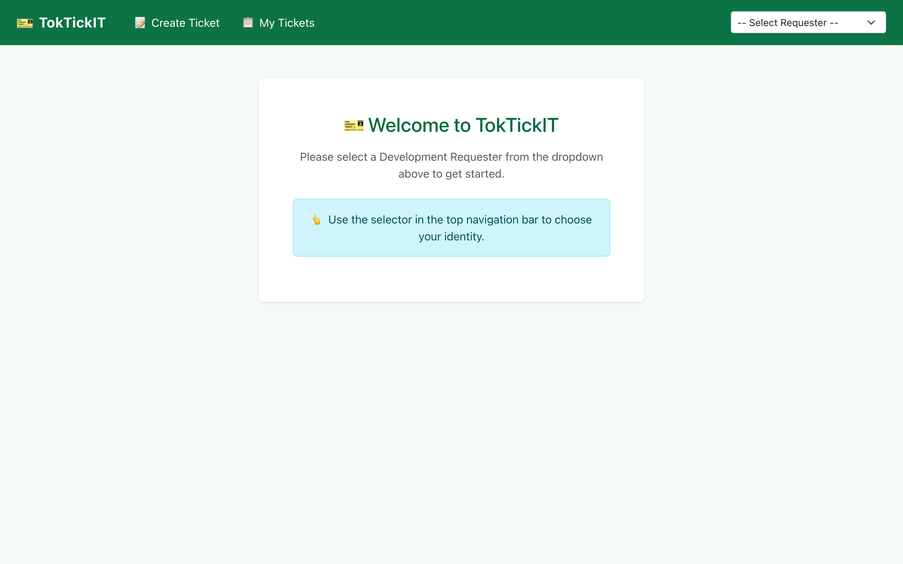

### 5.2 Requester Selector Dropdown & Navbar Context Header
The navigation bar features Zen Green theme (#006B3C) with glassmorphism backdrop filter, requester dropdown, and active requester tag with a clear button.


### 5.3 Dynamic Context Switching
Switching requesters dynamically updates greetings, ticket listings, and permissions across all pages.

| Dashboard — Jennifer Anderson | Dashboard — Michael Chen |
|-------------------------------|--------------------------|
| 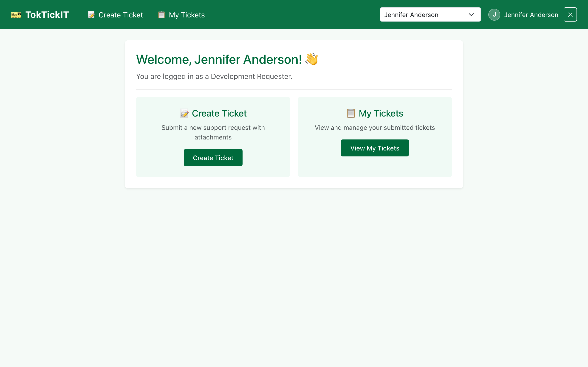 | 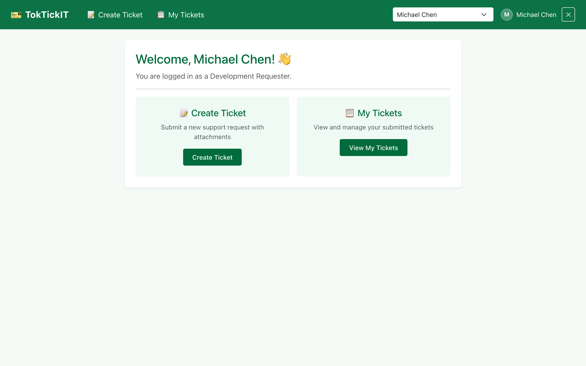 |

### 5.4 Create Ticket Form (Initial State)
Form features inputs for Summary, Description, Category dropdown, Related System dropdown, Priority selector, and Attachment uploader.

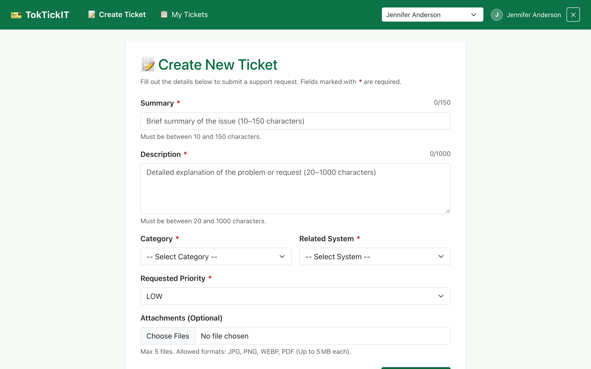

### 5.5 Form Validation & Errors
Form validates required fields, character lengths (Summary: 10-150 chars, Description: 20-1000 chars), and file limits (max 5MB per file).

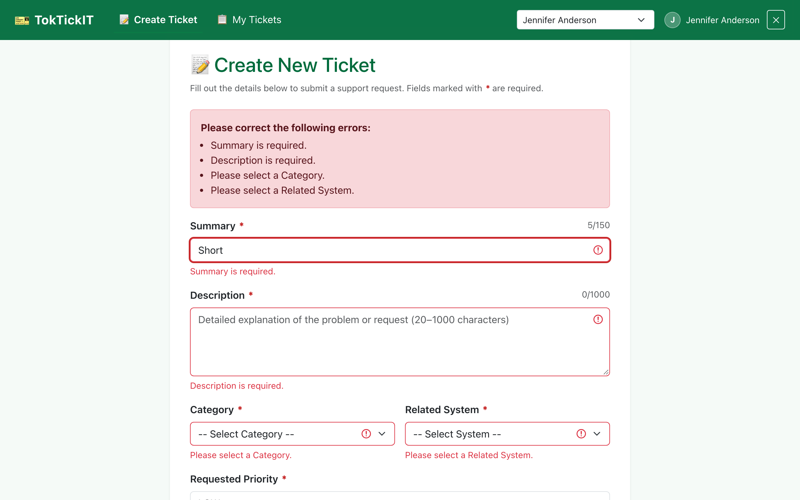

---

## Part 7: My Tickets Page & Data Isolation (10 pts)

My Tickets displays requester-isolated tickets with full search, filtering, sorting, and pagination controls.

### 7.1 My Tickets List — Jennifer Anderson
Shows tickets requested exclusively by Jennifer Anderson.

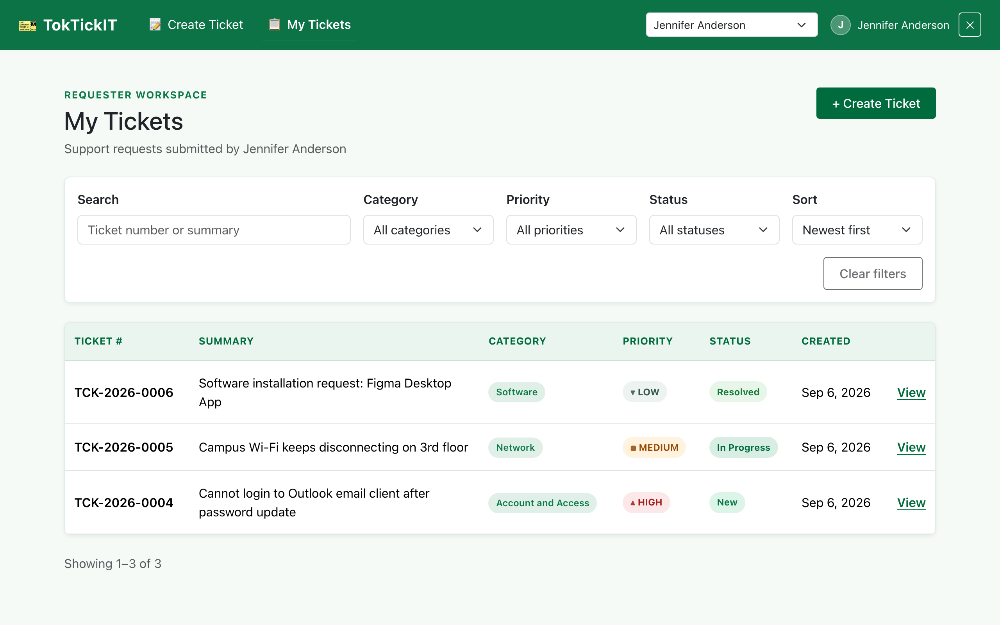

### 7.2 My Tickets List — David Kim (Context Isolation)
Switching to David Kim updates the list to display only David's support tickets.

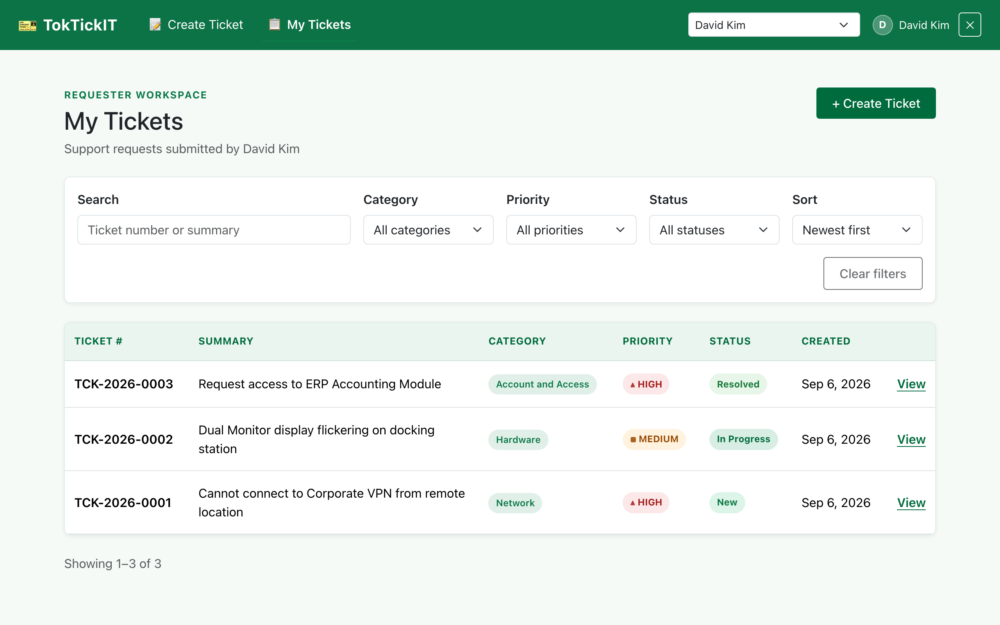

### 7.3 Search & Status Filtering Controls
Searching keywords (e.g., "VPN") dynamically filters ticket results.

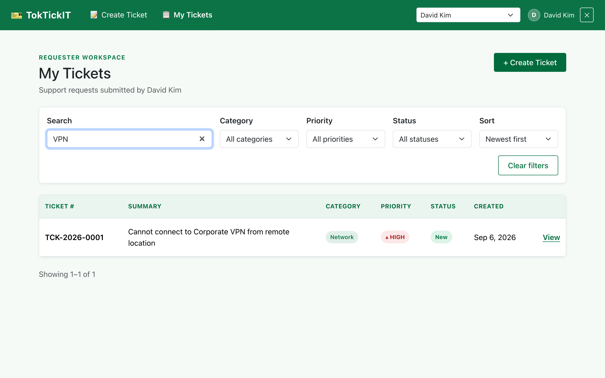

---

## Part 8: Ticket Detail — View Mode & Soft Removal (5 pts)

Displays full ticket details, metadata, description, and attached files with soft-removal capabilities.

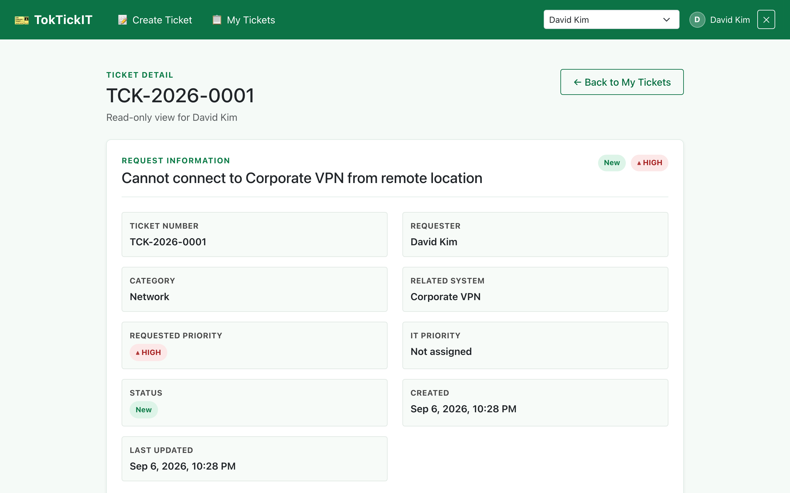

**Key Features:**
- Displays Ticket Number (e.g. `TKT-2026-000004`), Category, System, Priority, and Status badge.
- List of file attachments with download links and soft deletion modal.
- Soft removal sets `isRemoved: true` in DB while preserving original uploaded files.

---

## Part 9: UI Specification & Responsive Design (5 pts)

### 9.1 UI Specification Compliance
Verified against [`docs/lab-02/ui-spec.md`](https://github.com/nannaphatkn/toktickit/blob/lab2-staging/docs/lab-02/ui-spec.md):
- **Primary Color:** Zen Green (`#006B3C`)
- **Typography:** Inter / system sans-serif
- **UI States:** Loading spinner, Empty state banners, Error toasts, Validation messages

### 9.2 Responsive Layout Checklist & Viewports

| Viewport Category | Resolution | Status | Screenshots |
|-------------------|------------|--------|-------------|
| **Desktop** | ≥ 1024px (1280x800) | ✅ Tested & Passed | Screenshots 01 - 10 |
| **Tablet** | 768px - 1023px (768x1024) | ✅ Tested & Passed | Screenshots 11, 12 |
| **Mobile** | < 768px (375x812) | ✅ Tested & Passed | Screenshots 13, 14, 15 |

#### Tablet Viewports (768px)

| Tablet Dashboard | Tablet My Tickets |
|------------------|-------------------|
| 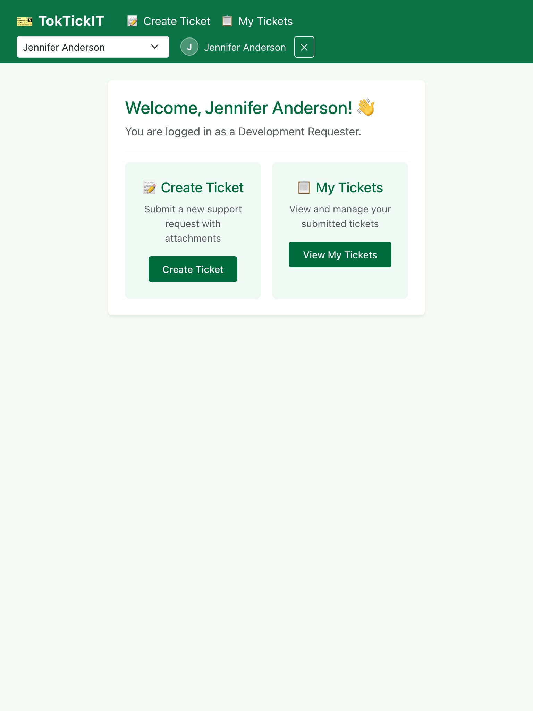 | 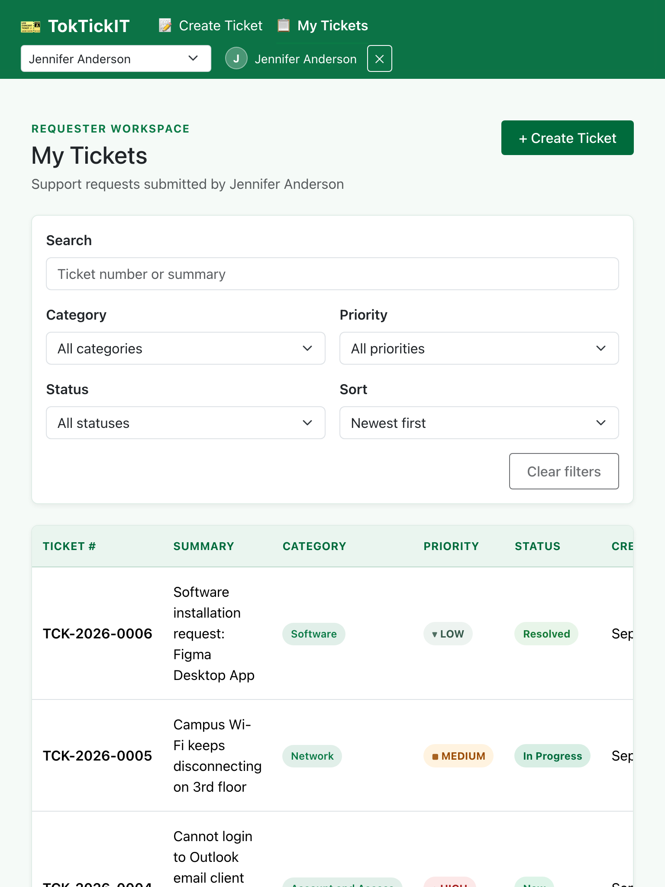 |

#### Mobile Viewports (375px)

| Mobile Dashboard | Mobile My Tickets | Mobile Create Ticket |
|------------------|-------------------|----------------------|
| 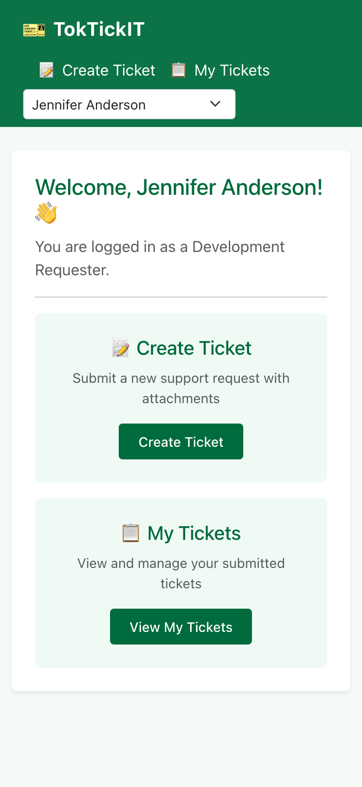 | 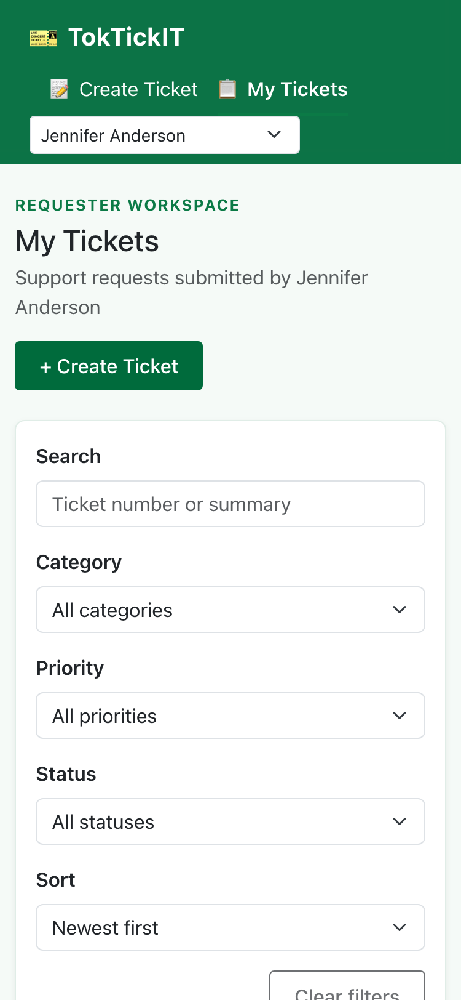 | 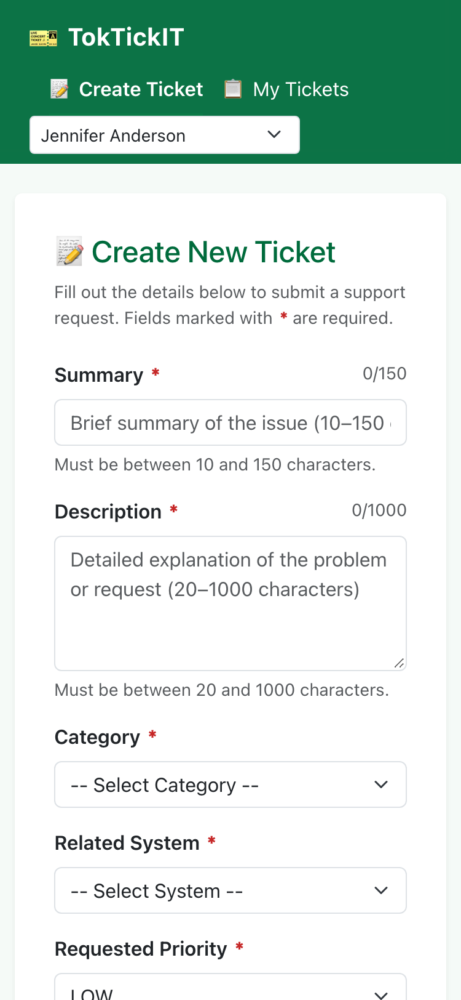 |
