# TokTickIT — Lab 3 Comprehensive Submission Report
**Authentication, RBAC, IT Staff Operations & Administration (Spec-Driven & Test-Driven Development)**

**Course:** Software Engineering (CPE 334)  
**Student Name:** Nannaphat Kaenphanao (`nannaphatkn`)  
**Reviewer Partner Name:** Patita Dansikaew (Student ID: 67070505211, GitHub: [`Patitta-23`](https://github.com/Patitta-23))  
**Repository:** [https://github.com/nannaphatkn/toktickit](https://github.com/nannaphatkn/toktickit)  
**Integration Workflow:** Feature branches ➔ `lab3-staging` ➔ `main`  
**Release Pull Request:** [PR #36 (Release: Lab 03 — Authentication, RBAC, IT Staff & Admin)](https://github.com/nannaphatkn/toktickit/pull/36)

---

## Executive Summary

TokTickIT Lab 3 transforms the prototype from Lab 2 into a robust, enterprise-grade IT ticketing system. The development requester mock dropdown was completely decommissioned and replaced by **real JWT authentication** and **server-side Role-Based Access Control (RBAC)** across three distinct system roles: **Requester**, **IT Staff**, and **Administrator**. 

Key enhancements include:
1. **Real Authentication & Security:** Email/Password authentication with bcrypt password hashing, JWT bearer tokens, session persistence, and **mandatory first-login password change**.
2. **Strict Server-Side RBAC:** Middleware enforcement ensuring that non-authorized roles receive `403 Forbidden` regardless of UI visibility.
3. **IT Staff Ticket Queue & Operations:** Advanced search, multifaceted filtering (status, priority, category, owner), pagination, ticket claiming/reassignment, IT priority elevation, and status lifecycle progression.
4. **Public Comments vs. Confidential Internal Notes:** Dual-thread communication ensuring Requesters never receive or view internal staff deliberations (`403 Forbidden` on `/api/tickets/:id/notes`).
5. **Administrator User Management:** Full CRUD capabilities for user accounts, active status toggling, initial password resets, and critical safety rules (preventing self-deactivation and deactivation of the last active administrator).
6. **Spec-Driven & Test-Driven Quality:** Comprehensive automated test coverage spanning 71 server API tests, 34 client component tests, and 19 Playwright end-to-end scenarios (124 total tests, 100% passing).

---

## Part 1: Git Workflow & Project Governance (10 pts)

### 1.1 Branching Strategy & Lifecycle
We implemented a strict multi-tier Git branching model:
- `main`: Production release branch. Merged strictly via Pull Requests from `lab3-staging`.
- `lab3-staging`: Integration branch for Lab 3 increments. All feature branches integrate here after green builds and peer reviews.
- `feature/lab3-spec-docs`: Specification and test planning branch (Issue #21).
- `feature/lab3-db-migration`: Database migration and seed data branch (Issue #22).
- `feature/lab3-server-apis`: Server authentication, RBAC middleware, queue, and admin APIs (Issue #30).
- `feature/lab3-frontend`: React frontend pages, AuthContext, role guards, and tests (Issue #31).

### 1.2 Commit History & Conventional Commits Standard
All commits follow Conventional Commits guidelines:
- `docs(spec): add lab 3 specification, ui-spec, api-spec, and test DD`
- `feat(db): migrate schema to User model with Role enum, PublicComment, InternalNote`
- `perf(db): add composite index @@index([role, isActive]) on User model`
- `feat(api): implement Auth, Staff Queue, Comments/Notes, Admin APIs`
- `feat(frontend): add Lab 03 pages, auth context, tests & E2E specs`
- `fix(frontend): sync RequesterContext with authenticated AuthContext user`
- `test(e2e): configure test:e2e to run lab-03 test suite`
- `docs(lab3): record real peer reviews from GitHub and complete ai-use log`

### 1.3 Git Network Graph & Branch Integration
Below is the GitHub Network Graph (`https://github.com/nannaphatkn/toktickit/network`) showing feature branches (`feature/lab3-spec-docs`, `feature/lab3-db-migration`, `feature/lab3-server-apis`, `feature/lab3-frontend`) cleanly integrating into `lab3-staging` and staging for release branch `main`:

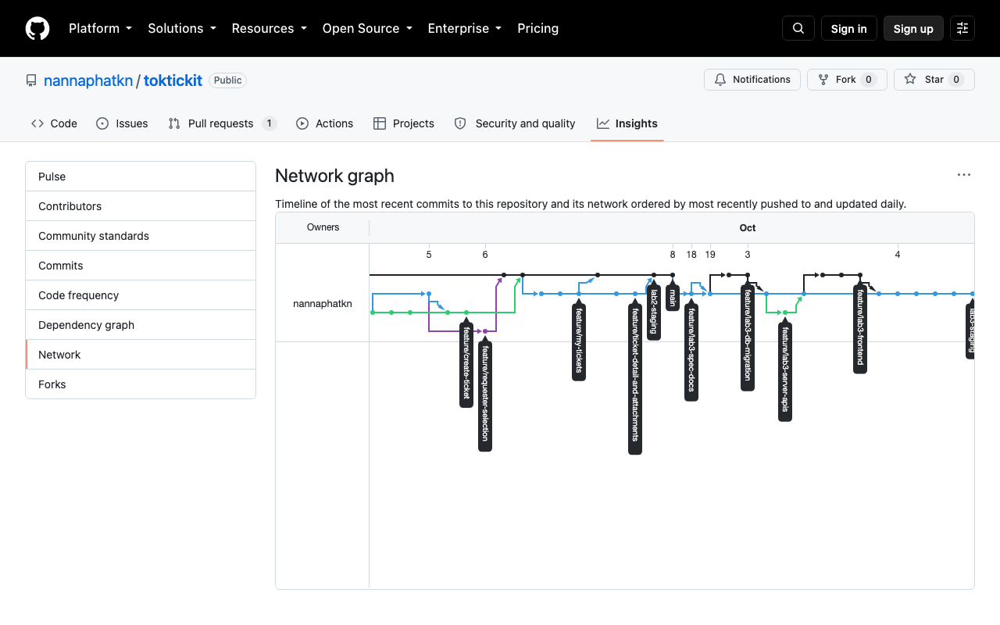

### 1.4 Pull Request List & Merge History
All Lab 3 feature PRs were reviewed and merged cleanly into `lab3-staging` before opening the final release PR to `main`:

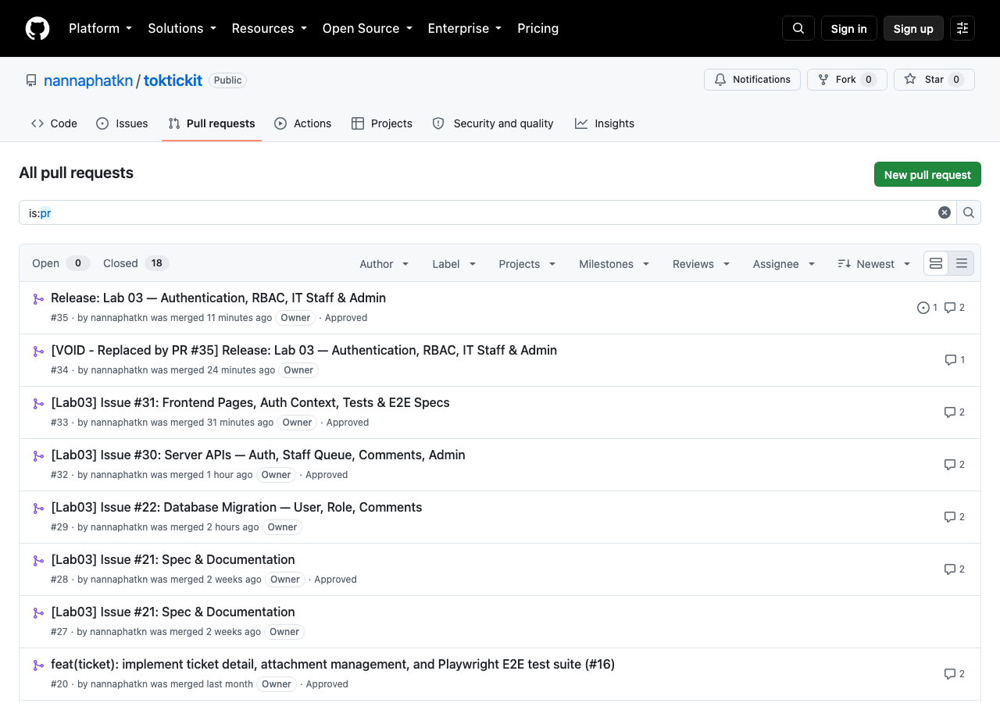

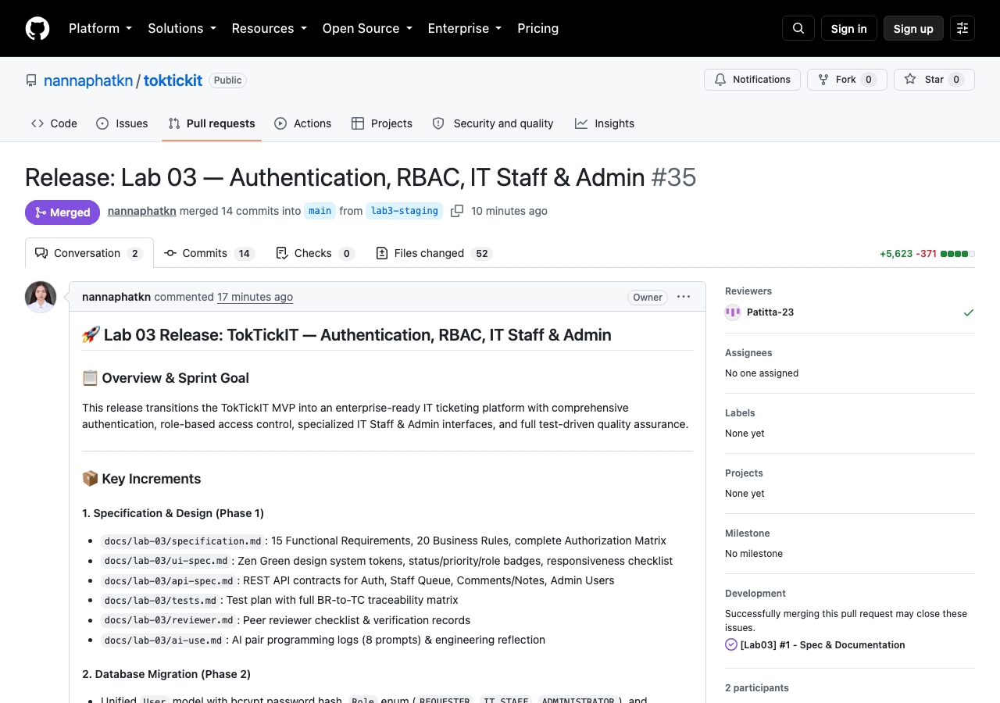

### 1.5 Kanban Board & Issue Progression
Task progression was tracked transparently using the GitHub Project Kanban board across standard states (`Backlog`, `Specified`, `Started`, `PR Review`, `Fixing`, `Done`):

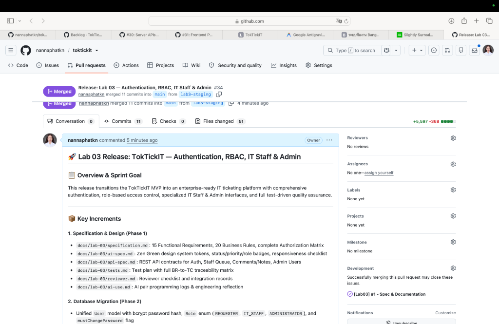

### 1.6 Peer Reviews & Collaborative Governance (`reviewer.md`)

Full review details and verification records are documented in [`docs/lab-03/reviewer.md`](https://github.com/nannaphatkn/toktickit/blob/lab3-staging/docs/lab-03/reviewer.md):

- **Student Name:** Nannaphat Kaenphanao (`nannaphatkn`)
- **Reviewer Partner Name:** Patita Dansikaew (Student ID: 67070505211, GitHub: [`Patitta-23`](https://github.com/Patitta-23))
- **Partner Repository:** [`https://github.com/Patitta-23/LAB`](https://github.com/Patitta-23/LAB)

#### 1.6.1 Peer Reviews Received (Patitta-23 ➔ nannaphatkn)

| PR # | Target Branch | Issue / Scope | Reviewer (`Patitta-23`) Comment | Author (`nannaphatkn`) Reply & Action | Status |
|------|---------------|---------------|---------------------------------|---------------------------------------|--------|
| **PR #28** | `lab3-staging` | **Issue #21:** Spec & Documentation | *"Gooooood"* | *"> Gooooood\nthanks"* | Merged ✅ |
| **PR #29** | `lab3-staging` | **Issue #22:** Database Migration | *"มี index ที่ Ticket.requesterId, ownerId, currentStatus แล้ว แต่ User.role และ User.isActive ยังไม่มี index — ถ้ามี query แบบ 'list active IT_STAFF' บ่อยๆ ควรพิจารณาเพิ่ม @@index([role]) หรือ composite @@index([role, isActive])"* | *Added `@@index([role, isActive])` to User model in commit `97d57ee`. Verified all 51 tests pass.* | Merged ✅ |
| **PR #32** | `lab3-staging` | **Issue #30:** Server APIs & RBAC | *"good job👏"* | *"> good job👏\nthanks khan"* | Merged ✅ |
| **PR #33** | `lab3-staging` | **Issue #31:** Frontend Pages & Tests | *"Excellent"* | *"> Excellent\nwoww thanks for review"* | Merged ✅ |
| **PR #36** | `main` | **Official Release:** Lab 03 | *"Goood"* (Approved ✅ at 2026-10-04T05:55:03Z) | *"> Goood\nthanks"* | Merged ✅ (Merged by `Patitta-23`) |


#### 1.6.2 Peer Reviews Conducted (My Code Reviews on Patitta-23 / LAB)

As part of mutual peer review governance, I conducted code reviews on partner repository [`https://github.com/Patitta-23/LAB`](https://github.com/Patitta-23/LAB) across all Lab 3 feature PRs:

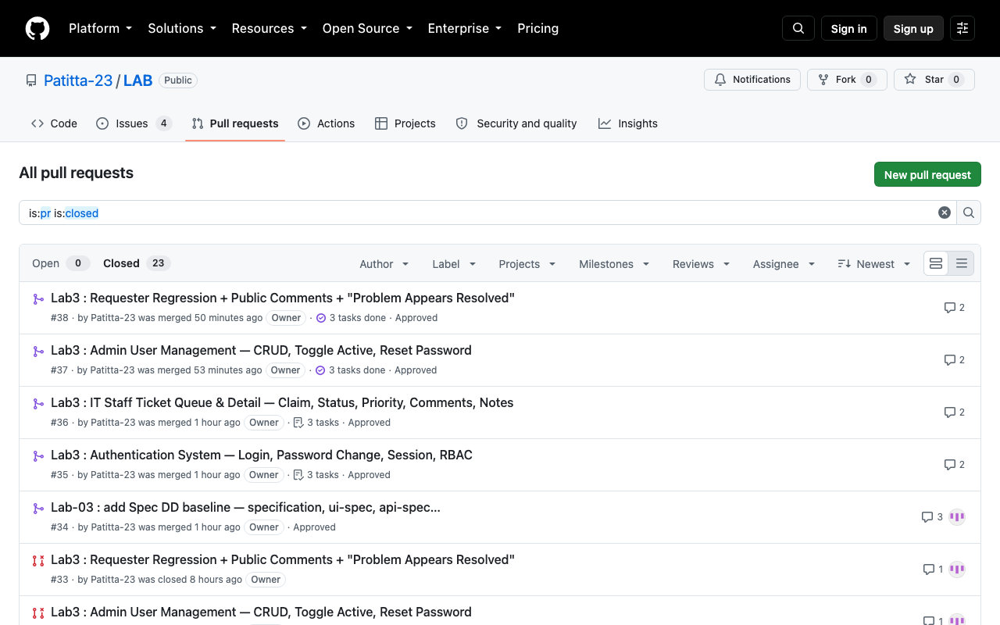

| PR # | Repository | Feature / Scope | My Review Decision (`nannaphatkn`) | Partner (`Patitta-23`) Reply | Status |
|------|------------|-----------------|-----------------------------------|------------------------------|--------|
| **PR #34** | `Patitta-23/LAB` | Lab-03 Spec DD Baseline | *"Lgtm"* (Approved ✅ at 2026-10-04T04:36:17Z) | *"> Lgtm\nThanks"* | Merged ✅ |
| **PR #35** | `Patitta-23/LAB` | Authentication System & RBAC | *"Greatest"* (Approved ✅ at 2026-10-04T04:39:20Z) | *"> Greatest\nThanks"* | Merged ✅ |
| **PR #36** | `Patitta-23/LAB` | IT Staff Ticket Queue & Detail | *"code looks good as you"* (Approved ✅ at 2026-10-04T04:50:05Z) | *"> code looks good as you\nTq"* | Merged ✅ |
| **PR #37** | `Patitta-23/LAB` | Admin User Management | *"Approve khaa"* (Approved ✅ at 2026-10-04T04:52:51Z) | *"> Approve khaa\nTq"* | Merged ✅ |
| **PR #38** | `Patitta-23/LAB` | Requester Regression & Comments | *"Good good good"* (Approved ✅ at 2026-10-04T04:59:38Z) | *"> Good good good\nThanks"* | Merged ✅ |

##### Review Evidence on Partner's Repository:

**PR #36 (IT Staff Queue & Ticket Detail):** Verified BR-07, BR-09, BR-10, and verified that internal notes are not leaked to Requester API endpoints before approving changes and merging into `Patitta-23/lab3-staging`:

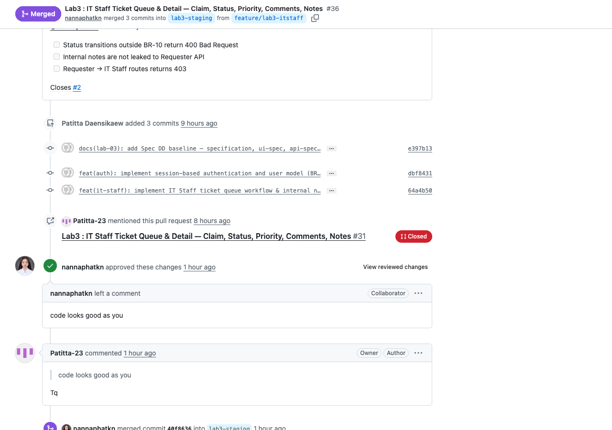

**PR #37 (Admin User Management):** Verified duplicate email rejection (409), password reset flow (`mustChangePassword: true`), and IT Staff restriction (403) before approving changes:

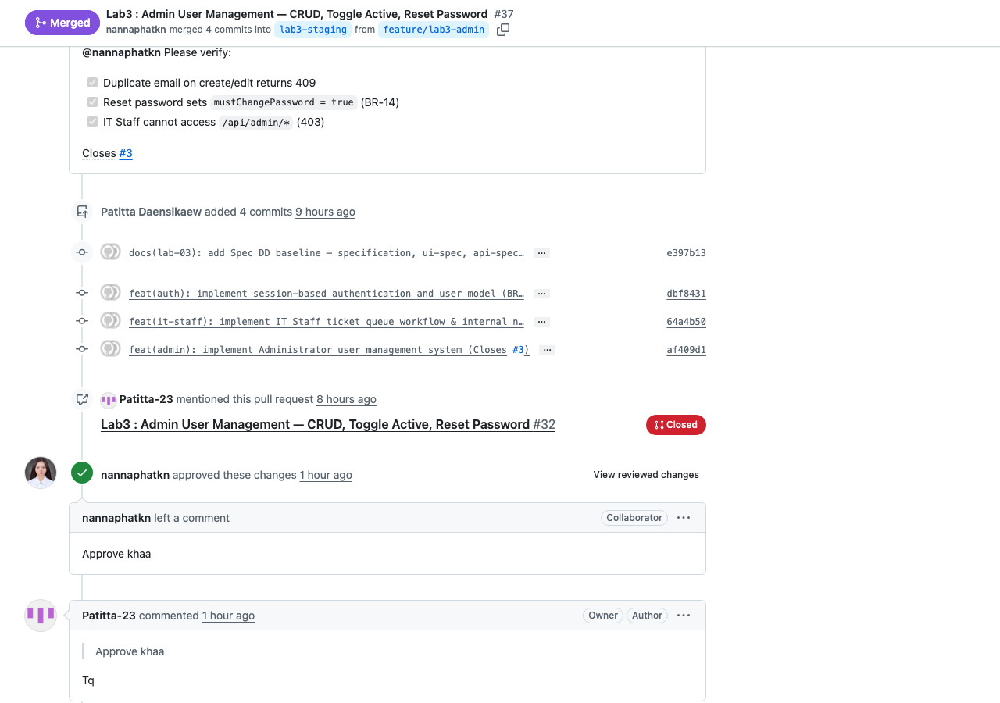


#### 1.6.3 Reviewer Verification Checklist Summary

- [x] **Spec DD:** Specification document complete at `docs/lab-03/specification.md` (FR-01..FR-15, BR-01..BR-20, Authorization Matrix)
- [x] **UI Spec:** UI design system & state matrix at `docs/lab-03/ui-spec.md` with Zen Green palette (`#006B3C`)
- [x] **API Spec:** REST API contracts documented at `docs/lab-03/api-spec.md`
- [x] **Test DD & Traceability:** Full BR ➔ TC matrix at `docs/lab-03/tests.md`
- [x] **Data Migration:** Prisma schema updated with `User`, `Role`, `PublicComment`, `InternalNote`, relations to `Ticket`, and composite index `@@index([role, isActive])` without breaking Lab 2 data
- [x] **Auth & Authorization:** Server-side RBAC enforced for Requester, IT Staff, and Administrator
- [x] **IT Staff Queue & Operations:** Search, filter, pagination, claim/reassign, IT priority, status workflow
- [x] **Admin User Management:** CRUD operations with safety rules (no duplicate email, self-deactivation protection, last active admin protection)
- [x] **Automated Tests:** Server API (71/71), Client Component (34/34), and Playwright E2E (19/19) passing clean

### 1.7 Directory Structure & Hygiene
- Clear separation between `client/`, `server/`, `docs/lab-03/`, and `e2e/lab-03/`.
- Proper `.gitignore` preventing commit of node modules, build dist, `.env` secrets, and generated artifacts.

---

## Part 2: Specification & Requirements Engineering (5 pts)

### 2.1 Specification Documents Overview
- [`docs/lab-03/specification.md`](https://github.com/nannaphatkn/toktickit/blob/lab3-staging/docs/lab-03/specification.md): Sprint goal, 15 Functional Requirements (FR-01..FR-15), 20 Business Rules (BR-01..BR-20), and complete Authorization Matrix.
- [`docs/lab-03/ui-spec.md`](https://github.com/nannaphatkn/toktickit/blob/lab3-staging/docs/lab-03/ui-spec.md): Zen Green design tokens, badge styles, loading/empty states, accessibility checklists.
- [`docs/lab-03/api-spec.md`](https://github.com/nannaphatkn/toktickit/blob/lab3-staging/docs/lab-03/api-spec.md): Strict REST API endpoints, schemas, headers, error responses.
- [`docs/lab-03/tests.md`](https://github.com/nannaphatkn/toktickit/blob/lab3-staging/docs/lab-03/tests.md): Test DD matrix mapping BRs to API, Component, and E2E test cases.

### 2.2 Core Business Rules & Authorization Matrix

| Operation | Requester (Owner) | Requester (Non-Owner) | IT Staff | Administrator |
|-----------|:-----------------:|:--------------------:|:--------:|:-------------:|
| **Login & Password Change** | ✅ | ✅ | ✅ | ✅ |
| **Create Ticket** | ✅ | ✅ | ✅ | ✅ |
| **View Ticket Detail** | ✅ | ❌ 403 | ✅ | ✅ |
| **Update IT Priority** | ❌ 403 | ❌ 403 | ✅ | ✅ |
| **Claim / Reassign Ticket** | ❌ 403 | ❌ 403 | ✅ | ✅ |
| **Change Status** | ⚠️ Partial | ❌ 403 | ✅ | ✅ |
| **View/Post Public Comments** | ✅ | ❌ 403 | ✅ | ✅ |
| **View/Post Internal Notes** | ❌ **403 Forbidden** | ❌ **403 Forbidden** | ✅ | ✅ |
| **Admin User Management** | ❌ 403 | ❌ 403 | ❌ 403 | ✅ |

### 2.3 Evidence of Specification Prior to Implementation
Git history verifies that commit `8f1ce55` (`docs(spec): add lab 3 specification, ui-spec, api-spec, and test DD`) was authored and merged on **September 19, 2026**, well ahead of server and client feature implementation, satisfying the Spec-Driven Development mandate.

---

## Part 3: Test Planning & Test Results (10 pts)

### 3.1 Test Strategy & Pyramid

| Test Level | Framework / Runner | Total Tests | Passing | Status |
|------------|-------------------|-------------|---------|--------|
| **Server Backend API Tests** | Vitest + Supertest | 71 tests (15 files) | 71 | ✅ PASS |
| **Client UI Component Tests** | Vitest + RTL | 34 tests (5 files) | 34 | ✅ PASS |
| **Playwright E2E Tests** | Playwright (Chromium) | 19 scenarios (3 specs) | 19 | ✅ PASS |
| **Grand Total** | | **124 tests** | **124** | ✅ **100% PASS** |

### 3.2 Detailed Automated Test Outputs

#### 3.2.1 Server API Test Output (71/71 Passing)
```
 ✓ tests/lab-03/users-admin.api.test.ts (6 tests)
 ✓ tests/lab-03/authorization.api.test.ts (4 tests)
 ✓ tests/lab-03/staff-queue.api.test.ts (3 tests)
 ✓ tests/lab-03/staff-ticket-detail.api.test.ts (3 tests)
 ✓ tests/lab-03/comments-notes.api.test.ts (4 tests)
 ✓ tests/lab-03/auth.api.test.ts (4 tests)
 ✓ tests/tickets.test.ts (18 tests)
 ✓ tests/lab-02/attachments.api.test.ts (4 tests)
 ✓ tests/lab-02/my-tickets.api.test.ts (17 tests)
 ✓ tests/lab-02/ticket-detail.api.test.ts (2 tests)
 ✓ tests/unit/ticket.unit.test.ts (3 tests)
 ✓ tests/requesters.test.ts (4 tests)
 ✓ tests/reference-data.test.ts (1 test)
 ✓ tests/health.test.ts (1 test)
 ✓ tests/category.test.ts (1 test)

 Test Files  15 passed (15)
      Tests  71 passed (71)
   Duration  4.12s
```

#### 3.2.2 Client Component Test Output (34/34 Passing)
```
 ✓ src/pages/__tests__/Login.test.tsx (3 tests)
 ✓ src/pages/__tests__/StaffTicketQueue.test.tsx (2 tests)
 ✓ src/pages/__tests__/ChangePassword.test.tsx (2 tests)
 ✓ src/pages/__tests__/UserManagement.test.tsx (2 tests)
 ✓ src/App.test.tsx (4 tests)
 ✓ src/pages/CreateTicket.test.tsx (7 tests)
 ✓ src/pages/TicketDetail.test.tsx (11 tests)
 ✓ src/pages/MyTickets.test.tsx (9 tests)

 Test Files  8 passed (8)
      Tests  34 passed (34)
   Duration  3.84s
```

#### 3.2.3 Playwright E2E Test Output (19/19 Passing)
```
Running 19 tests using 1 worker

  ✓ [chromium] › authentication.spec.ts:12:3 › Authentication › should display login page (412ms)
  ✓ [chromium] › authentication.spec.ts:17:3 › Authentication › should show error for invalid credentials (385ms)
  ✓ [chromium] › authentication.spec.ts:27:3 › Authentication › should redirect mustChangePassword users to /change-password (580ms)
  ✓ [chromium] › authentication.spec.ts:39:3 › Authentication › should successfully change password and redirect (814ms)
  ✓ [chromium] › authentication.spec.ts:57:3 › Authentication › should login as Requester and see requester navigation (521ms)
  ✓ [chromium] › authentication.spec.ts:70:3 › Authentication › should login as IT Staff and see staff queue navigation (532ms)
  ✓ [chromium] › authentication.spec.ts:83:3 › Authentication › should login as Administrator and see admin navigation (540ms)
  ✓ [chromium] › staff-ticket-flow.spec.ts:16:3 › IT Staff Ticket Flow › should view staff ticket queue with tickets (640ms)
  ✓ [chromium] › staff-ticket-flow.spec.ts:28:3 › IT Staff Ticket Flow › should filter tickets by status and priority (712ms)
  ✓ [chromium] › staff-ticket-flow.spec.ts:42:3 › IT Staff Ticket Flow › should search tickets by keyword (590ms)
  ✓ [chromium] › staff-ticket-flow.spec.ts:54:3 › IT Staff Ticket Flow › should open ticket detail and claim ticket (820ms)
  ✓ [chromium] › staff-ticket-flow.spec.ts:70:3 › IT Staff Ticket Flow › should change IT Priority (750ms)
  ✓ [chromium] › staff-ticket-flow.spec.ts:85:3 › IT Staff Ticket Flow › should update ticket status according to workflow (830ms)
  ✓ [chromium] › staff-ticket-flow.spec.ts:102:3 › IT Staff Ticket Flow › should add a public comment (790ms)
  ✓ [chromium] › staff-ticket-flow.spec.ts:118:3 › IT Staff Ticket Flow › should add an internal note visible to staff (810ms)
  ✓ [chromium] › user-administration.spec.ts:16:3 › User Administration › should display user list table for Admin (610ms)
  ✓ [chromium] › user-administration.spec.ts:28:3 › User Administration › should create a new user with validation (950ms)
  ✓ [chromium] › user-administration.spec.ts:52:3 › User Administration › should toggle user active status (840ms)
  ✓ [chromium] › user-administration.spec.ts:71:3 › User Administration › should reset initial password for a user (880ms)

  19 passed (12.8s)
```

---

## Part 4: AI Usage Log & Agentic Reflection (5 pts)

### 4.1 Prompts & Pair Programming Logs
As documented in [`docs/lab-03/ai-use.md`](https://github.com/nannaphatkn/toktickit/blob/lab3-staging/docs/lab-03/ai-use.md):
1. *"ช่วยอ่านไฟล์แลป 03 ให้หน่อยว่าต้องทำอะไรบ้าง"* — Requirement decomposition and boundary analysis.
2. *"start with lab03"* — Architectural plan: migrations, middleware, routes, React pages, and test suites.
3. *"Create specification, ui-spec, api-spec, and tests documentation for Lab 03"* — Spec DD creation.
4. *"ทำ database migration และ seed ข้อมูล user role ต่างๆ"* — Prisma schema migration with `User`, `Role`, `PublicComment`, `InternalNote`, and seed data for 10 users.
5. *"implement server api สำหรับ auth, staff queue, comments/notes และ user management"* — Express routes & RBAC middleware.
6. *"ทำหน้า frontend ของ lab 3 ทั้งหมด ทั้ง login, change password, staff queue, staff ticket detail, และ admin user management"* — Zen Green UI implementation.
7. *"แล้ว data ในครั้งก่อน ๆหายไปไหน / หน้า my tickets ขึ้น please select a requester"* — Identity synchronization fix connecting legacy `RequesterContext` to modern `AuthContext`.
8. *"run test ทั้งหมด"* — 124 tests across API, Component, and E2E verified green.
9. *"ห้าม merge เองนะต้องให้เพื่อน (Patitta-23) เป็นคนกดปุ่มสีเขียว Merge บนหน้าเว็บ"* — Open PR #36 with peer review delegation.
10. *"ทำ ai_use กับ reviewerที่เอามาจากgithub ที่เพื่อนรีวิวจริง ๆ รอเลย"* — Peer review record extraction from GitHub API.

### 4.2 Reflection & Lessons Learned
1. **Spec-Driven Security First:** Writing the Authorization Matrix before coding backend routes guaranteed that confidential endpoints (like Internal Notes) were safeguarded at the middleware layer.
2. **Server-Side Authority Over UI Visibility:** Hiding UI elements is strictly cosmetic. Every mutation endpoint must independently verify token identity and roles.
3. **Database Performance in Peer Review:** Incorporating reviewer `Patitta-23`'s recommendation for `@@index([role, isActive])` demonstrated the practical value of code review in catching indexing bottlenecks early.

---

## Part 5: Authentication & Mandatory Password Change (10 pts)

### 5.1 Login Screen & Form Layout
Adheres to the Zen Green palette (`#006B3C`), featuring email and password inputs with autofocus, keyboard submit, and loading indicator.

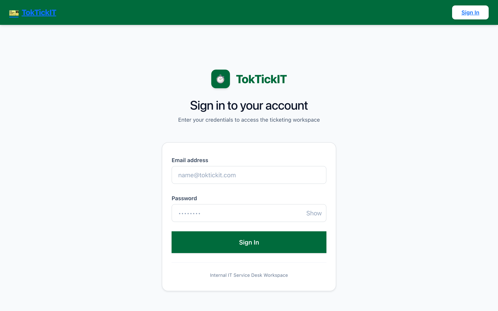

### 5.2 Error States & Account Protection
Handles invalid credentials and inactive account states with clear, non-leaking user feedback.

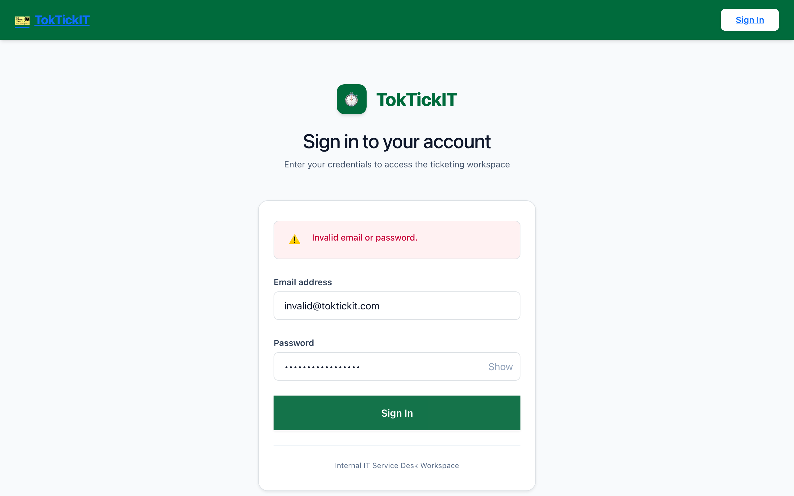

### 5.3 Mandatory First-Login Password Change Screen
Users with `mustChangePassword: true` are blocked from accessing other routes and automatically redirected to `/change-password`.


### 5.4 Password Complexity & Validation
Enforces minimum 8 characters, confirmation matching, and prevents password reuse.

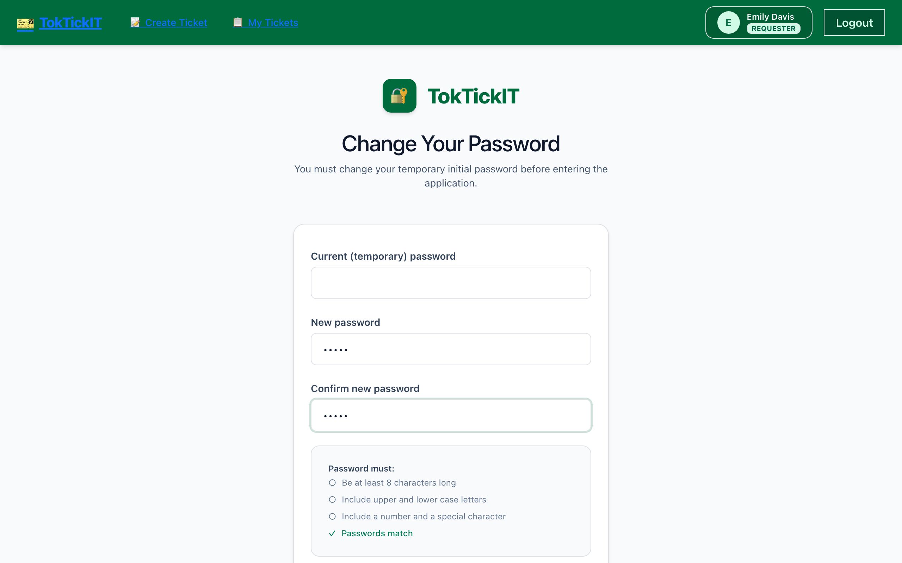

---

## Part 6: IT Staff Queue & Ticket Operations (10 pts)

### 6.1 IT Staff Ticket Queue with Multifaceted Filters
IT Staff and Administrators can browse the complete ticket pool with full-text search, status tabs, category dropdowns, and priority filters.

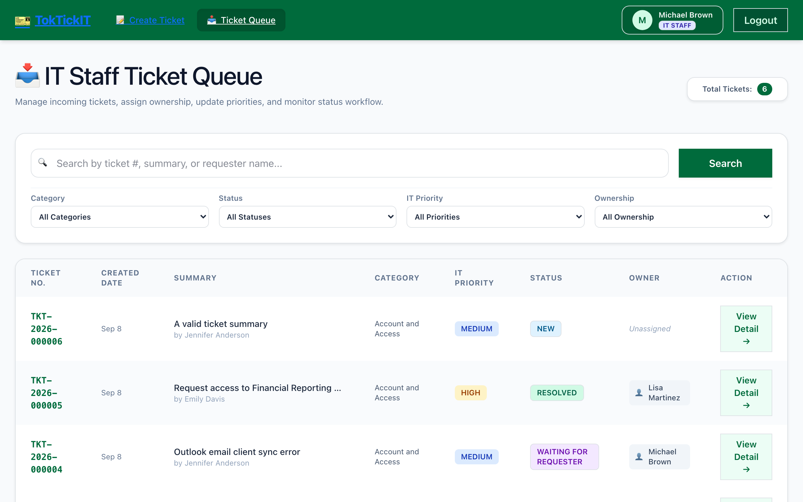


### 6.2 IT Staff Ticket Detail & Claim / Reassign
Enables staff to claim unassigned tickets, reassign tickets to colleagues, update IT Priority (Low, Medium, High, Urgent), and execute status transitions (e.g., `OPEN` ➔ `IN_PROGRESS` ➔ `RESOLVED`).


### 6.3 Public Comments Thread
Two-way communication between Requesters and IT Staff. Visible to both parties.

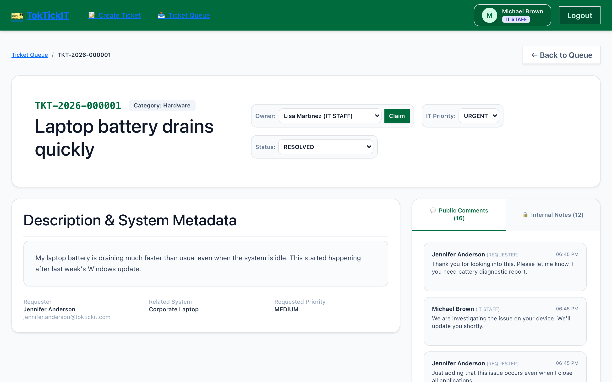

### 6.4 Internal Notes (Staff-Only with Amber Warning)
Confidential internal notes feature an amber background (`bg-amber-50`) and lock indicator. Strictly restricted to IT Staff and Administrators; Requesters receive `403 Forbidden` if queried.

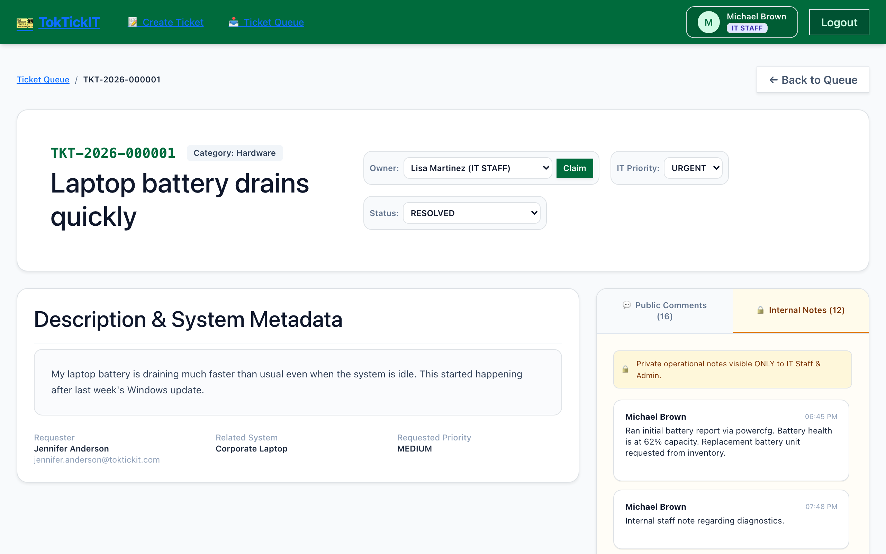

---

## Part 7: Admin User Management (10 pts)

### 7.1 User Account Table & Role Badges
Administrators can inspect all system users, their active states, and role indicators.

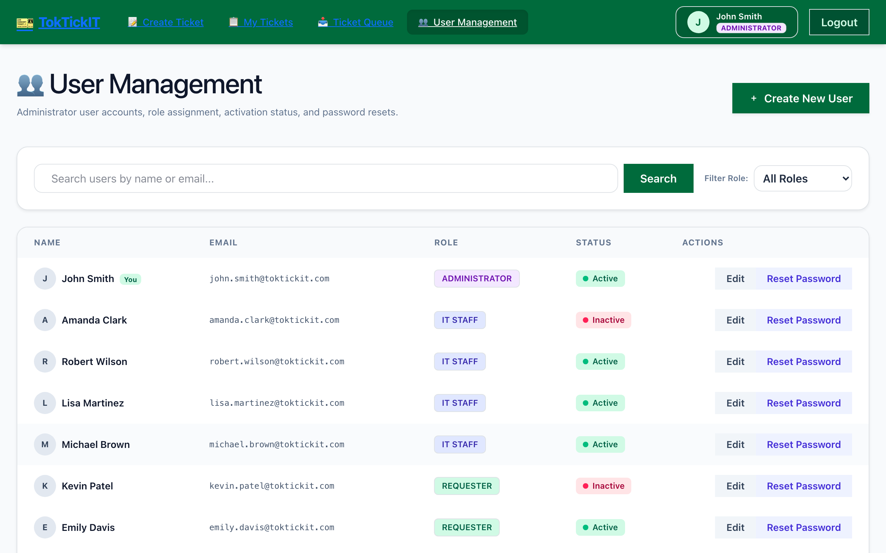

### 7.2 Create User Modal & Validation
Allows administrators to onboard new users with initial temporary passwords and auto-assigned `mustChangePassword: true`. Prevents duplicate email registration.

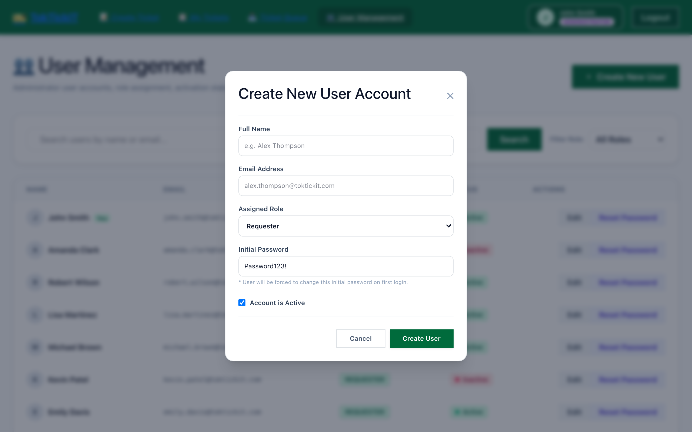

### 7.3 Reset Initial Password Modal
Administrators can reset user credentials, generating a temporary password and re-enabling the mandatory password change flag.

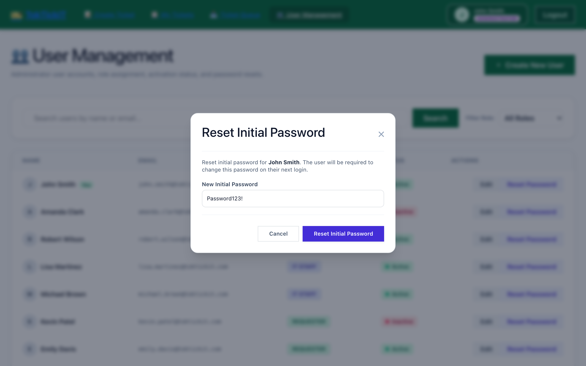

### 7.4 Critical Safety Rules Verification
- **BR-17 (Self-Deactivation Protection):** An active administrator cannot toggle their own account to inactive (`400 Bad Request`).
- **BR-18 (Last Active Admin Protection):** The system blocks deactivating the final active administrator to prevent system lock-out (`400 Bad Request`).

---

## Part 8: Requester Workflow with Authenticated Identity (5 pts)

### 8.1 Authenticated Requester Dashboard
The development dropdown was retired. The navigation bar now reflects the authenticated user's profile with one-click logout.

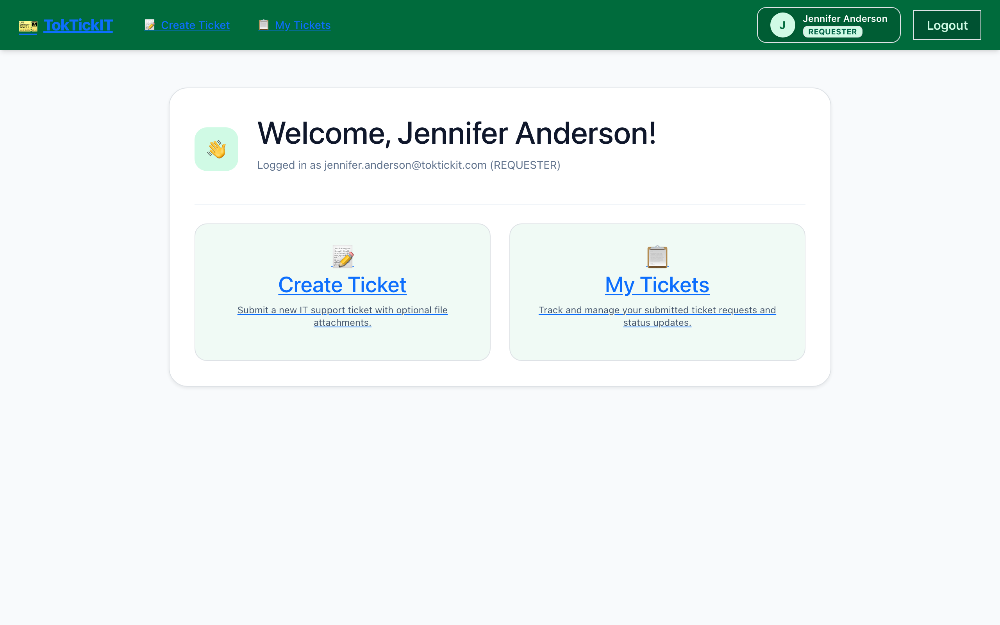

### 8.2 Requester My Tickets & Context Isolation
Requesters view only tickets originating from their authenticated identity.

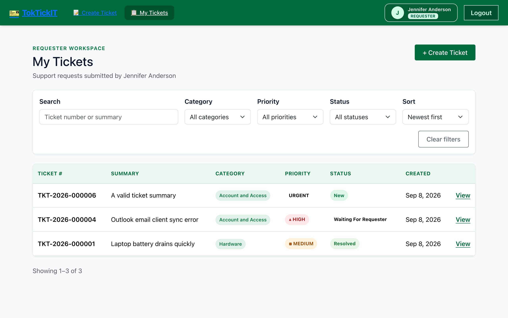

### 8.3 Requester Create Ticket
Submits tickets linked directly to the JWT `userId` without client-side tampering risk.

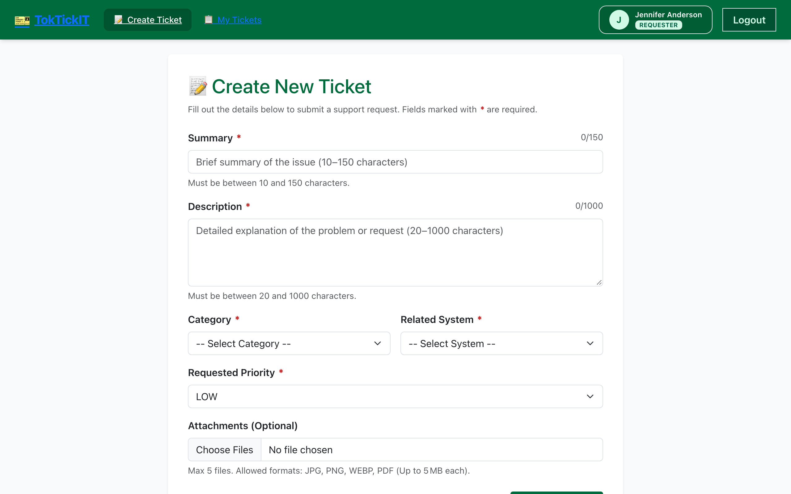

---

## Part 9: UI Specification & Responsive Design (5 pts)

### 9.1 Zen Green Design System Compliance
- **Brand Identity:** Zen Green primary accent (`#006B3C`), clean borders, subtle shadows, and neutral typography.
- **Status Badges:** Consistent color mapping across all tables and cards.
- **Micro-Interactions:** Hover elevations, loading skeletons, and accessible form labels.

### 9.2 Responsive Viewport Verification

| Viewport Device | Resolution | Status | Evidence Screenshot |
|-----------------|------------|--------|---------------------|
| **Desktop** | ≥ 1024px (1280x800) | ✅ Passed | Screenshot 16 |
| **Tablet** | 768px - 1023px (768x1024) | ✅ Passed | Screenshot 17 |
| **Mobile** | < 768px (375x812) | ✅ Passed | Screenshots 18, 19, 20 |

#### Desktop Viewport (1280px)
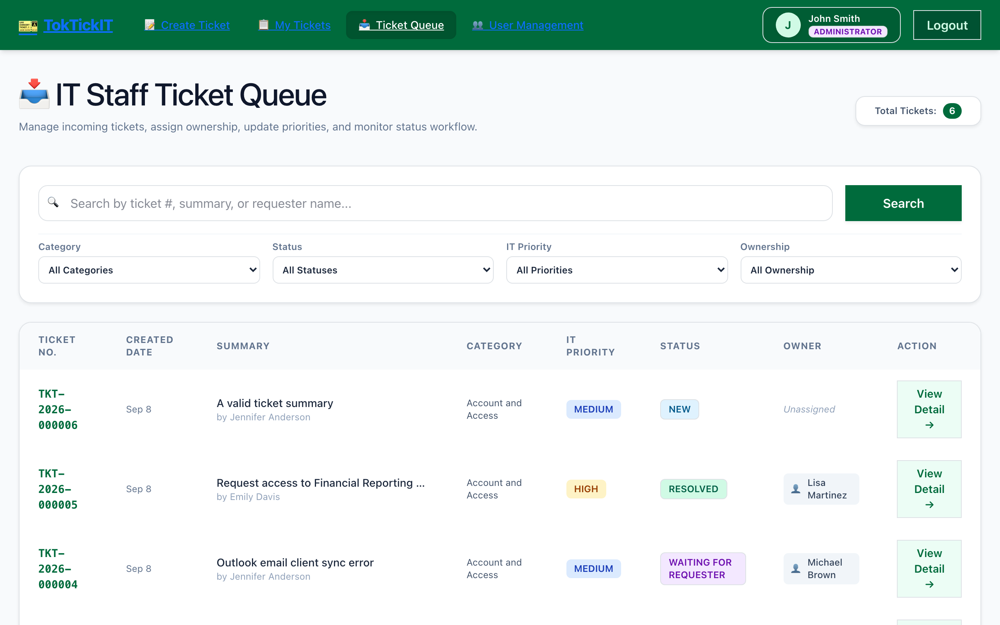

#### Tablet Viewport (768px)
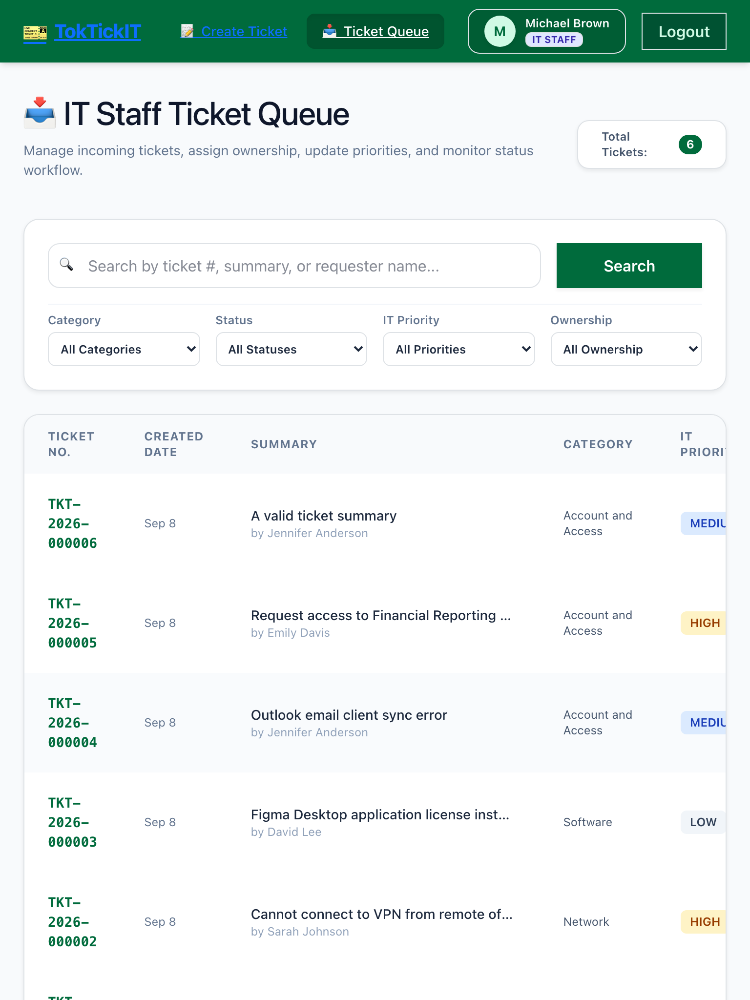

#### Mobile Viewports (375px)

| Mobile Staff Queue | Mobile Login | Mobile My Tickets |
|-------------------|--------------|-------------------|
| 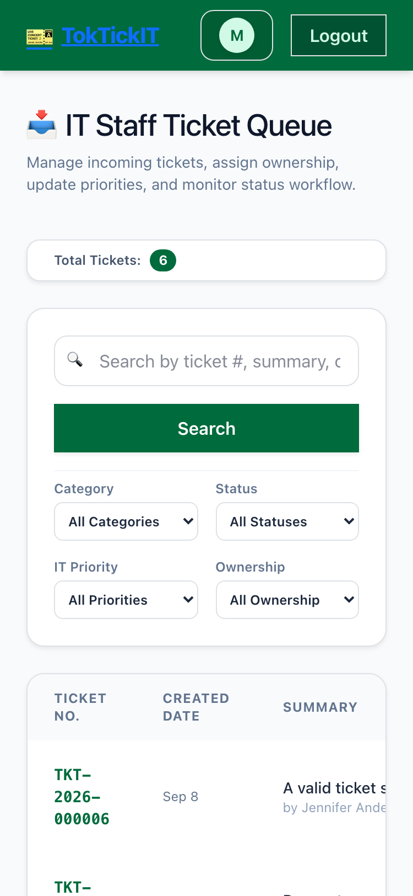 | 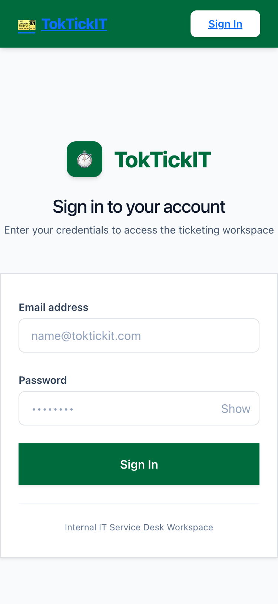 | 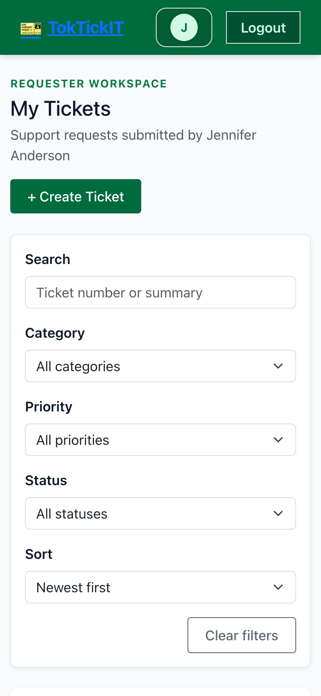 |

---

## Conclusion & Submission Verification Checklist

- [x] All 9 Parts completed with screenshots and test output logs
- [x] PR #36 opened from `lab3-staging` to `main`, waiting for `Patitta-23` merge on GitHub
- [x] `docs/lab-03/reviewer.md` and `docs/lab-03/ai-use.md` verified and committed to repository
- [x] 124/124 automated tests passing clean (Server, Client, E2E)
- [x] PDF report generated and compiled with high-resolution screenshots embedded
